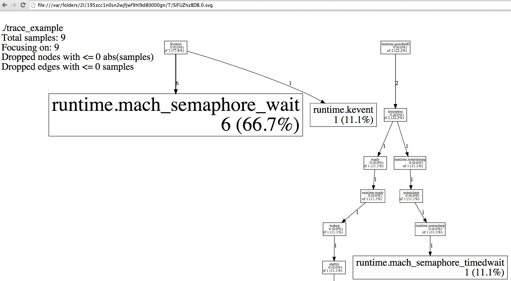

为golang程序使用pprof远程查看httpserver运行堆栈,cpu耗时等信息
pprof是个神马玩意儿？

pprof - manual page for pprof (part of gperftools)

是gperftools工具的一部分

gperftools又是啥？

These tools are for use by developers so that they can create more robust applications. Especially of use to those developing multi-threaded applications in C++ with templates. Includes TCMalloc, heap-checker, heap-profiler and cpu-profiler.

一个性能分析的工具，可以查看堆栈、cpu信息等等。

 

在golang中如何使用呢？下面就来看看。

 

1. 在一个httpserver中，只需要一行代码

 

复制代码

```
package main

import (
"flag"
"log"
"net/http"
_ "net/http/pprof"
"sync"
"time"
)


func main() {
flag.Parse()

//这里实现了远程获取pprof数据的接口
go func() {
log.Println(http.ListenAndServe("localhost:6060", nil))
}()

var wg sync.WaitGroup
wg.Add(10)
for i := 0; i < 10; i++ {
go work(&wg)
}

wg.Wait()
// Wait to see the global run queue deplete.
time.Sleep(3 * time.Second)
}

func work(wg *sync.WaitGroup) {
time.Sleep(time.Second)

var counter int
for i := 0; i < 1e10; i++ {
time.Sleep(time.Millisecond * 100)
counter++
}
wg.Done()
}
```

复制代码
2.编译运行这个程序

go build trace_example.go

./trace_example

 

3. 通过浏览器访问

http://localhost:6060/debug/pprof/

能够查看到程序的overview

 

 

 

4.你也可以通过终端命令查看

```
Then use the pprof tool to look at the heap profile:

go tool pprof http://localhost:6060/debug/pprof/heap
Or to look at a 30-second CPU profile:

go tool pprof http://localhost:6060/debug/pprof/profile
Or to look at the goroutine blocking profile:

go tool pprof http://localhost:6060/debug/pprof/block
```

复制代码

```
qpzhang@qpzhangdeMac-mini:~/gocode $go tool pprof http://localhost:6060/debug/pprof/profile
Read http://localhost:6060/debug/pprof/symbol
Gathering CPU profile from http://localhost:6060/debug/pprof/profile?seconds=30 for 30 seconds to
  /var/folders/2l/195zcc1n0sn2wjfjwf9hl9d80000gn/T/mmBnpdkv0D
Be patient...
Wrote profile to /var/folders/2l/195zcc1n0sn2wjfjwf9hl9d80000gn/T/mmBnpdkv0D
Welcome to pprof!  For help, type 'help'.
(pprof) top10
Total: 9 samples
       6  66.7%  66.7%        6  66.7% runtime.mach_semaphore_wait
       1  11.1%  77.8%        1  11.1% runtime.kevent
       1  11.1%  88.9%        1  11.1% runtime.mach_semaphore_signal
       1  11.1% 100.0%        1  11.1% runtime.mach_semaphore_timedwait
       0   0.0% 100.0%        7  77.8% System
       0   0.0% 100.0%        1  11.1% notetsleep
       0   0.0% 100.0%        1  11.1% ready
       0   0.0% 100.0%        2  22.2% runtime.gosched0
       0   0.0% 100.0%        1  11.1% runtime.mach_semrelease
       0   0.0% 100.0%        1  11.1% runtime.notetsleepg
(pprof) web
Total: 9 samples
Loading web page file:////var/folders/2l/195zcc1n0sn2wjfjwf9hl9d80000gn/T/SlFUZhzBDB.0.svg

```

在这30秒中新的终端进行测试并发

```

ab -n 10000 -c 200 http://localhost:6060/
```


复制代码
web命令生成了很cool的svg图片，在浏览器中打开。




除了远程拉取，你还可以自己编写代码，把这些数据写入文件（实现 net/http/pprof 中的几个路由，开启或关闭追踪信息）。

具体可参考：http://blog.golang.org/profiling-go-programs
https://github.com/hyper-carrot/go_command_tutorial/blob/master/0.12.md
